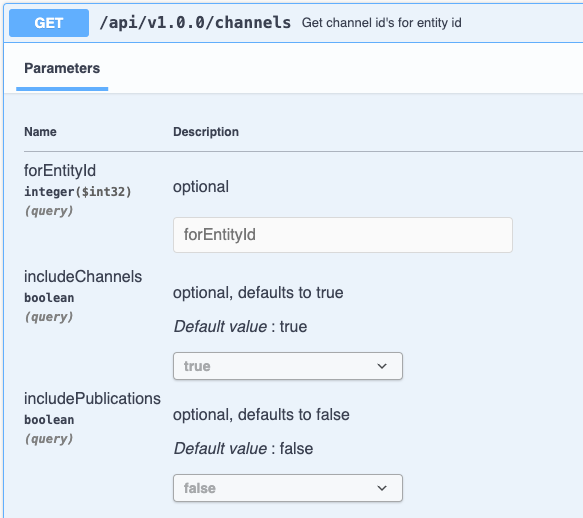

<p align="center">
  
</p>

# InRiver

[![Latest Version on Packagist][ico-version]][link-packagist]
[![Total Downloads][ico-downloads]][link-downloads]

InRiver Laravel is a package that allows you to easily integrate with the inRiver PIM API.

## Usage

Out of the box we have all the endpoints available to you as they are on the documentation.

For example, to get channel id's for an entity id, the documentation shows the following:

https://apieuw.productmarketingcloud.com/swagger/index.html#/Channel/GetChannelsForEntityId

]

To use this in the package, you would do the following:
```php
$channels = InRiver()->channels->getChannelsForEntityId('Product');

// As per the documentation, you can also pass the other parameters.
$channels = InRiver()->channels->getChannelsForEntityId(
    forEntityId: 'Product', 
    includeChannels: true,
    includePublications: true
);
```
So the URL endpoint is channels and the function from the URL is GetChannelsForEntityId, so that is the function you call.

As well as this, we also provide some other methods for your convenience. These can be found below.

### Examples
- [Entity](examples/entities/entity.md)
- [Links](examples/links/link.md)
- [Models/Categories](examples/model/Category.md)
- [Models/Cvls](examples/model/Cvls.md)
- [Models/EntityTypes](examples/model/EntityTypes.md)
- [Models/FieldSets](examples/model/FieldSets.md)
- [Models/Languages](examples/model/Languages.md)
- [Models/RestrictedFields](examples/model/RestrictedFields.md)
- [Models/SpecificationTemplates](examples/model/SpecificationTemplates.md)

## Installation

Via Composer

```bash
composer require scolmore/inriver-laravel
```

## Change log

Please see the [changelog](changelog.md) for more information on what has changed recently.

## Testing

```bash
composer test
```

## Contributing

Please see [contributing.md](contributing.md) for details and a todolist.

## Security

If you discover any security related issues, please email sam@scolmore.com instead of using the issue tracker.

## Credits

- [Samuel Loft][link-author]
- [All Contributors][link-contributors]

## License

MIT. Please see the [license file](license.md) for more information.

[ico-version]: https://img.shields.io/packagist/v/scolmore/inriver.svg?style=flat-square
[ico-downloads]: https://img.shields.io/packagist/dt/scolmore/inriver.svg?style=flat-square
[ico-travis]: https://img.shields.io/travis/scolmore/inriver/master.svg?style=flat-square
[ico-styleci]: https://styleci.io/repos/12345678/shield

[link-packagist]: https://packagist.org/packages/scolmore/inriver
[link-downloads]: https://packagist.org/packages/scolmore/inriver
[link-travis]: https://travis-ci.org/scolmore/inriver
[link-styleci]: https://styleci.io/repos/12345678
[link-author]: https://github.com/scolmore
[link-contributors]: ../../contributors
